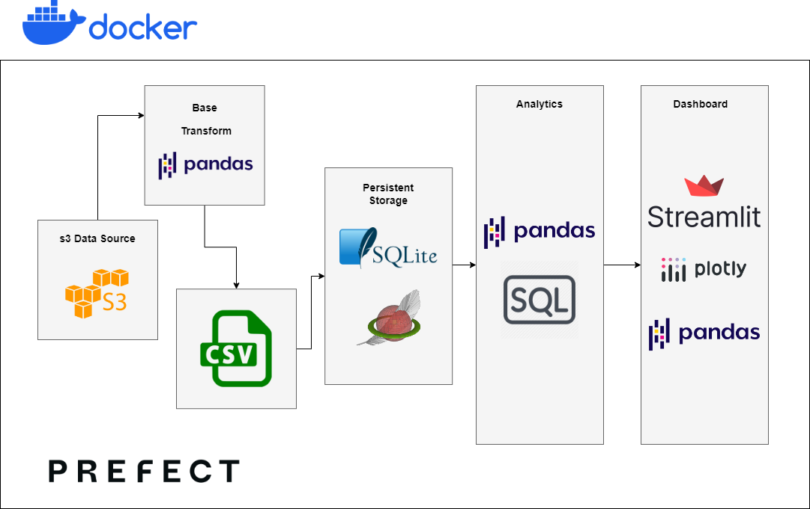
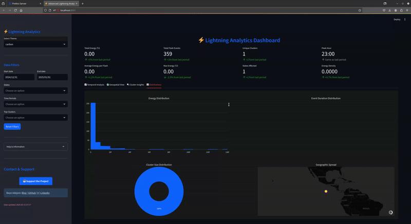

<div align="center">
 <h1>⚡Lightning Containers: docker-powered lightning atmospheric dataset 📈</h1>
    <p align="center">
        <a href='https://ko-fi.com/bayoadejare' target='_blank'></a>
    </p>

</div>

<div align="center">

[](https://lightning-containers.streamlit.app)
[](https://github.com/BayoAdejare/lightning-containers/actions)
[](https://github.com/BayoAdejare/lightning-containers/blob/main/LICENSE)

</div>


## Table of Contents

- [Introduction](#introduction)
- [Project Structure](#project-structure)
- [Requirements](#requirements)
- [Installation](#installation)
- [ETL Flow](#etl-flow)
- [Clustering Flow](#clustering-flow)
- [Dashboard Map](#dashboard-map)
- [Testing](#testing)
- [CI/CD](#cicd)
- [License](#license)
- [Acknowledgements](#acknowledgements)

## Introduction 

This is a monolith Docker image to help you get started with geospatial analysis and visualization of lightning atmospheric data. The data comes from US **National Oceanic and Atmospheric Administration (NOAA)** [Geostationary Lightning Mapper (GLM) - Data Product](https://www.goes-r.gov/products/baseline-lightning-detection.html) sourced from AWS s3 buckets. There are currently two main component:
1. ETL Ingestion - data ingestion and analysis processes.
2. Streamlit dashboard app - frontend gis visualization dashboard.

Processing done using Pandas dataframes, SQlite with Spatialite extension as the local storage and self-hosted Prefect server instance for orchestration and observability of the processing pipelines.


|<a href="img/main_tech_stack.png" align="center"></a>
|:--:|
|Architecture: Docker + Prefect + Pandas + SQLite + Streamlit|

**Brief Data Summary [Lightning Cluster Filter Algorithm (LCFA)](https://www.star.nesdis.noaa.gov/goesr/documents/ATBDs/Baseline/ATBD_GOES-R_GLM_v3.0_Jul2012.pdf)**

```
The multidimensional data structures stored in the netCDF4 files contain a rich variety of 
data including metadata with descriptors. In general, the main variables: flashes, groups, 
events form an hierarchy, i.e. a series of detected radiant events are clustered into groups and groups 
are clustered into flashes using LCFA.
```
## Project Structure 

```
lightning-containers/
|
├── src/
│   ├── flows.py
│   └── tasks/
|       └── analytics/
|       └── etl/
├── app/
|   └── dashboard.py
├── notebooks/
|   └── clustering/
|   └── mapping/
|   └── streaming/
├── tests/
│   └── test_clustering.py
|   └── test_extract.py
|   └── test_load.py
|   └── test_transform.py
├── docs/
│   └── index.md
├── img/
├── .streamlit/
│   └── config.toml
│   └── secrets.toml
├── .github/
│   └── workflows/
│       └── docker-image.yml
├── data/
├── .gitignore
├── LICENSE
├── CONTRIBUTING.md
├── CODE_OF_CONDUCT.md
├── Dockerfile
├── docker-compose.yml
└── README.md
```

## Requirements

|Resource|Minimum|Recommended|
|--------|-------|-----------|
|CPU     |2 cores|4+ cores   |
|RAM     |6GB    |16GB       |
|Storage |8GB    |24GB       |

## Installation

### Quick Start: Docker Container

1. Clone the repository.

```
git clone https://github.com/BayoAdejare/lightning-containers.git
cd lightning-containers
```

2. Can be ran with docker containers or installed locally.

```
docker-compose up -d # spin up containers
```

### Local install

Make sure you have the virtual environment configured:

```
python -m venv venv
source venv/bin/activate  # On Windows, use `venv\Scripts\activate`
```

For requirements, this can be installed from the project directory via pip's setup command:

`pip install -r requirements.txt # =< python3.12 `

### Start Flow

Run the command to start the prefect workflow orchestration: 

`prefect server start # Start prefect engine and UI i.e. http://localhost:4200/`

The prefect orchestration platform is required to start the scheduling, from the prefect ui, you can run and monitor the data flows.

Run the command to start the data app. 

`python src/flows.py # Start backend`

`streamlit run app/dashboard.py # Start frontend i.e. http://localhost:8501/`

## ETL Flow

ETL flow data tasks:

+ `Source`: **extracts** NOAA GOES-R GLM file datasets from AWS s3 bucket, default is GOES-18. 
+ `Transformations`: **transforms** dataset into time series csv.
+ `Sink`: **loads** dataset to persistant storage.

#### Data Ingestion

Ingests the data needed based on specified time window: start and end dates.

##### Data Processes

+ `extract`: downloads NOAA GOES-R GLM netCDF4 files from AWS s3 bucket.
+ `transform`: converts GLM netCDF into time and geo series CSVs.
+ `load`: loads CSVs to a local backend, persistant SQLite with Spatialite extension.

## Clustering Flow


#### Cluster Analysis

Performs grouping of the ingested data by implementing K-Means clustering algorithm.

##### Data Tasks

+ `preprocessor`: prepares the data for cluster model, clean and normalize the data.
+ `kmeans_cluster`: fits the data to an implementation of k-means cluster algorithm.
+ `silhouette_evaluator`: evaluates the choice of 'k' clusters by calculating the silhouette coefficient for each k in defined range.
+ `elbow_evaluator`: evaluates the choice of 'k' clusters by calculating the sum of the squared distance for each k in defined range.

## Dashboard Map


<p align="center">

|<a href="./img/lightning-containers-dashboard.gif" align="center"></a>
|:--:|
|Lightning containers dashboard|

</p>

## Testing

Use the following command to run tests:

`pytest`

## CI/CD

This project uses GitHub Actions for CI/CD. The workflow is defined in the `.github/workflows/docker-image.yml` file. This includes:

- Automated testing on pull requests
- Data quality checks on scheduled intervals
- Deployment of updated ml models and Spark jobs to production

## Contributing

Please read [CONTRIBUTING.md](CONTRIBUTING.md) for details on our contributing guidelines and the process for submitting pull requests.

## License

This project is licensed under the Apache 2.0 License - see the [Apache 2.0 License](LICENSE) file for details. 

## Acknowledgements

This work would not have been possible without amazing open source software and datasets, including but not limited to:

+ [GLM Dataset from NOAA NESDIS](https://www.star.nesdis.noaa.gov/goesr/documents/ATBDs/Baseline/ATBD_GOES-R_GLM_v3.0_Jul2012.pdf)
+ [Prefect from PrefectHQ](https://docs.prefect.io/api-ref/prefect/)
+ [Streamlit](https://docs.streamlit.io/)
+ Built on the codebase of [Lightning Streams](https://github.com/BayoAdejare/lightning-streams).

Thank you to the authors of these software and datasets for making them available to the community!
